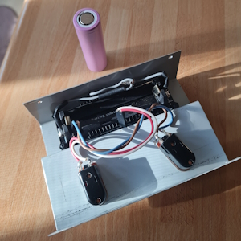
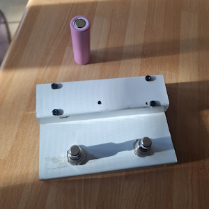
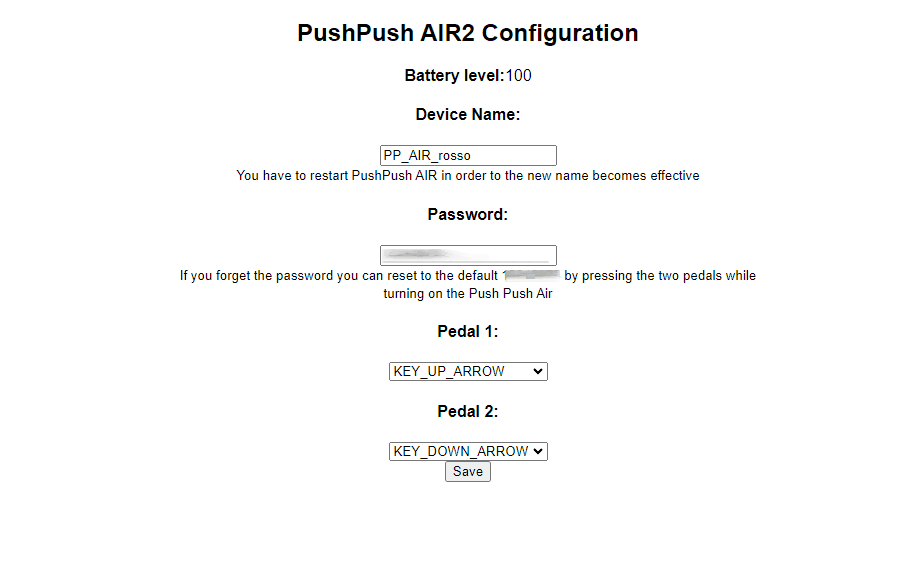
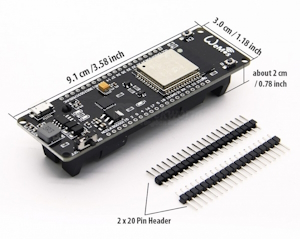

# Push Push Air

A little (but expandable) battery powered pedalboard that, emulating a Bluethooth keyboard, sends keystrokes (for example it can turn pages on a PDF reader... ). 

Made with an ESP32

Configurable via WiFI (you can choose the keystrokes that you want to send)




## How to use ##
- Turn on your PushPush AIR
- Go to the Bluethooth manager on your mobile, tablet or computer and start the search for new devices
- In a few seconds it should appear "PushPushAIR2" (or the new name of the device if you already changed it[see below] )
- Click/Tap on the discovered PushPushAIR to pair it with your mobile device
- PushPushAIR will appear and act as a remote Bluethooth keyboard

Out of the box PushPushAIR is configured to send the key cursor left and right. Check the app that you want to control and, if it needs different keys, go to the Configuration section and change the keystrokes that Push Push Air send.

### Change configuration ###
On the configuration page you can:
 - **Select the keystrokes sent** by the Push Push Air
 - **Set the device name** that idetify the Push Push AIR on WiFI and Bluethooth (you need to restart the device in order to render effective the name's change)
 - **Change the passowrd** to access the configuration page


#### How to access the configuration page ###
- Turn on the PPA while pushing the right-most pedal. Keep the pedal pressed for at least 2 seconds.
- The status led will be steady blue.
- Now connect from a computer or mobile device to the wifi network "Push Push AIR" and insert the password
- Once the connection is etablished, browse to 192.168.4.1 to use the configuration page.

- Click on Save to store your new configuration
- Please remember to click on "Finish" when you are done with the setup: in this way the WiFI access point will be closed (the led turns off). _Please note that after 5 minutes from the last click on the buttons in the configuration page, the Push Push AIR WiFi access point will turn off automatically_ . This is important for two reasons:
    - It will save on battery charge
    - No one (even if he has your password) will be able to change the settings during your performance ;-)
  
### Reset the password to the factory setting ###
 If you change the password of the Configuration page and you forget it, you can revert to the factory one.
 
 The factory password is: `12345678`

 **How to reset:**
 - Turn on the PPA while pushing both pedals. The Status led starts blink fast
 - Keep pressed both the pedals for 5 seconds, untile the Status led turn steady on
 - Wait 2/3 seconds untile the led turns off.
 - The reset is now complete. 
 
## How to build a Push Push Air ##

I used a board that have the 18650 battery and charger included in it like this:
(https://wiki.geekworm.com/index.php/WEMOS_ESP32_Board_with_18650_Battery_Holder)



see References folder for pictures and pinout

But then I also made some Push Push Air without battery (powered via the usual USB calble) with a classic ESP32 dev bpoard.

Any EXP32 developement board shuld be ok to run the Push Push Air code. 

### Device Customization ###
By default the pedals/buttons are connected to Pins `21` and `23`, and the only led used is `LED_BUILTIN`, however you can customize this.

The PIN and LED assignement is done in a separate file, named `customize.h`

- uncomment `#include "customize.h"` directive at the beginning of the script
- create a `customize.h` file in the same folder of the main script
- Put the following code in the `customize.h` file and change it as you need:

```C++

#define BATTERY_POWERED TRUE // delete if your devices doesn't have a battery
/* Pedals/Buttons connections */
#define PEDAL1_PIN 23
#define PEDAL2_PIN 21
/* Leds connections */
#define PEDAL1_LED_PIN 2 // Blink when pedal/button 1 is pressed
#define PEDAL2_LED_PIN 2 // Blink when pedal/button 2 is pressed
#define STATUS_LED_PIN 2 // Blink to signal device's statuses
```


## Compiling the firmware ##
 
If you are using the same board with integrated battery that I used,  in Arduino IDE select the 
 _WeMos WiFI&Bluethooth Battery_

Otherwise select the board you are using
 
As Partition Scheme select:
 _Huge APP (3MB No OTA/1MB SPIFF)_

**Libraries used:**

Please install the following libraries:

- 18650CL [https://github.com/garubi/Push-Push-Air/blob/07942ff5a0dff5b79e755875ea191aa9724bfb78/README.md#L98](https://github.com/garubi/Push-Push-Air/blob/07942ff5a0dff5b79e755875ea191aa9724bfb78/README.md#L98)
- BleKeyboard 0.3.2beta
- Preferences
- Bounce2

 

 